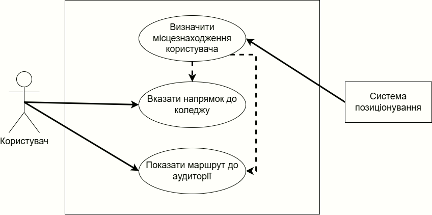
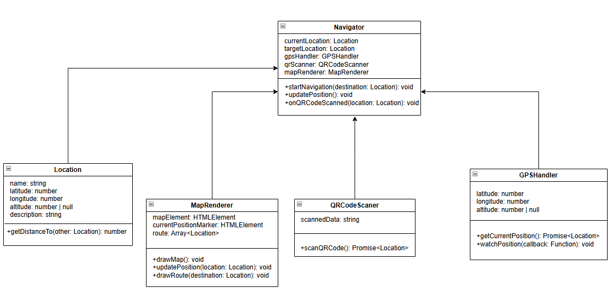

# КОНЦЕПЦІЯ ПРОЕКТУ

Етап: *Аналізу проекту (Envisioning)*

Проект: Застосунок-навігатор для “Днів відкритих дверей”

Команда: CodeWay

Виконали:
>*Кабановський І.В.*

## **1. НЕОБХІДНІСТЬ ПРОЕКТУ**

Ітеративний підхід до процесу розробки (характерний для MSF) вимагає використання гнучкого способу ведення документації - *живі документи (living documents)* мають змінюватися в ході еволюції проекту. Такий підхід істотно відрізняється від принципів ведення документації каскадної моделі, де процес розробки починається лише після того, як будуть готові і зафіксовані всі вимоги і специфікації.

Документація проектів MSF, як і їх програмний код, створюється ітеративно. На *фазі створення концепції (аналізу)* плани мають форму опису високорівневих *підходів* і в процесі підготовки поширюються серед членів проектної групи та інших зацікавлених осіб для отримання відгуків. 

Наприклад, підхід до тестування може бути коротко сформульований під час фази аналізу, а його перетворення в план тестування відбувається на пізніх фазах. Після переходу до *фази планування* документи поступово допрацьовуються, виникають детальні плани які знову надходять на перевірку всіма зацікавленими сторонами, і описаний процес повторюється ітеративно. Типи планів і загальна кількість документів, які їх описують, можуть змінюватись від проекту до проекту

### **1.1. Обгрунтування необхідності**

Основною задачею застосунку є вирішення проблеми навігації абітурієнтів в коледжі. А саме допомогти абітурієнту знайти кабінет 221.

### **1.2. Бачення проекту**

Web-застосунок, з футуристичним дизайном, але без зайвих деталей. Інтерфейс повинен бути мінімально необхідним. Легке та інтуєтивне розуміння, використання застосунку. 

### **1.3. Аналіз вигод**

>В результаті впровадження системи, зацікавлені сторони отримають наступні вигоди:
>- Абітурієнти
>   - Швидке та зручне знаходження потрібних кабінетів без зайвих запитань 
>   - Зменшення стресу та невпевненості при першому візиті до коледжу
>   - Можливість ознайомлення зі структурою коледжу заздалегідь 
>- Викладачі
>   - Менше часу витрачається на пояснення маршруту абітурієнтам
>   - Можливість швидше розпочати заняття без затримок через загублених відвідувачів 
>- Адміністрація коледжу
>   - Покращення організації заходів завдяки чіткій навігації
>   - Підвищення іміджу коледжу як сучасного навчального закладу, що використовує технології
>   - Зменшення навантаження на персонал, що відповідає за координацію відвідувачів
>- Студенти волонтери
>   - Менше запитів від абітурієнтів щодо навігації
>   - Можливість зосередитися на інших аспектах допомоги під час заходу
 
## **2. КОНЦЕПЦІЯ РІШЕННЯ**

*Концепція рішення* (solution concept) надає загальний опис підходів, які проектна група планує використовувати для вирішення проблем та/або задоволення вимог зацікавлених сторін.

### **2.1. Цілі та Завдання**

>Основні *цілі проекту* зі створення навігації в коледжі: 
>- **полегшення навігації абітурієнтів під час “Днів відкритих дверей”**
>   - швидкий пошук кабінету 221 через веб-застосунок
>   - інтерактивна карта з маршрутами до ключових локацій
>   - покрокові текстові або голосові підказки для навігації
>- **підвищення організованості заходу**
>   - зменшення кількості загублених відвідувачів
>   - зменшення навантаження на викладачів та студентів-волонтерів, які допомагають з навігацією
>   - можливість централізованого оновлення інформації про розташування аудиторій
>- **створення позитивного іміджу коледжу**
>   - використання сучасних технологій у процесі організації заходу
>   - демонстрація турботи про комфорт та зручність відвідувачів
>   - покращення першого враження абітурієнтів та їхніх батьків
>- **спрощення взаємодії з відвідувачами**
>   - можливість швидкого оновлення інформації у разі змін у розкладі або розташуванні кабінетів
>   - інтеграція з чат-ботом або FAQ для відповідей на типові питання
>   - підтримка QR-кодів для швидкого доступу до навігації

### **2.2. Припущення і Обмеження**
>Основні *припущення* стосовно функціональності проекту: 
>- Абітурієнти мають доступ до смартфонів або інших пристроїв з інтернет-з’єднанням.
>- QR-коди можуть бути розміщені у ключових місцях коледжу для швидкого доступу до навігації.
>- Інформація про розташування аудиторій буде оновлюватись адміністрацією коледжу у разі змін.
>
> *Обмеження*, які слід враховувати:
>- Розробка використовуватиме лише HTML, CSS та JavaScript без серверної частини.
>- Веб-застосунок має бути адаптований для мобільних пристроїв та коректно відображатися у популярних браузерах (Chrome, Firefox, Edge, Safari).
>- Відсутня інтеграція з картографічними сервісами (Google Maps, OpenStreetMap), оскільки навігація потрібна лише в межах коледжу.
>- Система не передбачає реєстрацію чи авторизацію користувачів – доступ до навігації має бути відкритим.
>- Завантаження сторінки та навігація мають бути максимально швидкими, без значних затримок.
>- Перший прототип веб-застосунку має бути готовий протягом трьох тижнів після початку розробки.

### **2.3. Аналіз використання**

### **2.4. Вимоги**
>Основні вимоги до функціональності застосунку-навігатора для “Днів відкритих дверей”:
>- можливість швидкого пошуку кабінету 221 за допомогою інтерактивної навігації
>- відображення покрокових інструкцій для переміщення коледжем
>- підтримка сканування QR-кодів для автоматичного відкриття маршруту
>- мінімалістичний, футуристичний інтерфейс із максимально простою навігацією
>- адаптація для мобільних пристроїв (зручність використання на смартфонах)
>- доступ до інформації без необхідності авторизації
>- швидке завантаження сторінок і відсутність затримок у відображенні контенту
>- можливість перегляду загальної карти коледжу та основних зон

#### СИСТЕМНІ ВИМОГИ
>Системні вимоги до продукту: 
>- застосунок має бути веб-орієнтованим і працювати у браузері без необхідності встановлення
>- підтримка сучасних браузерів (Chrome, Firefox, Edge, Safari)
>- коректне відображення на мобільних пристроях та планшетах
>- відсутність необхідності у серверній частині (усі дані мають бути доступні у статичному форматі)
>- інтерактивність реалізується за допомогою JavaScript (без використання backend-технологій)
>- застосунок має бути легким, швидким і не перевантажувати пристрої користувачів
>- дотримання принципів UX/UI для забезпечення інтуїтивного використання

### **2.5. Рамки**

#### ФУНКЦІОНАЛЬНІСТЬ РІШЕННЯ
>Основні можливості навігаційного застосунку для “Днів відкритих дверей”:
>- інтерактивний пошук маршруту до кабінету 221
>- покрокова візуалізація шляху всередині будівлі
>- сканування QR-коду для швидкого завантаження маршруту
>- адаптивний веб-інтерфейс для мобільних пристроїв
>- відображення загальної карти коледжу

#### ЗА РАМКАМИ РІШЕННЯ

>З огляду на фіксований термін роботи над проектом за рамки рішення команда вирішила винести наступні можливості:
>- підтримка декількох мов (фокус на українській мові для основної аудиторії)
>- голосові підказки (може бути додано в майбутньому як покращення UX)
>- мобільний додаток (рішення базується на веб-технологіях для зручності доступу без встановлення)
### **2.6. Критерії схвалення рішення**

>Рішення про готовність системи до впровадження замовник буде приймати на основі наступних *критеріїв*:
>- реалізовано всю функціональність рішення, описану в цьому документі (окрім можливостей, які за межами рішення)
>- навігація дозволяє безперешкодно знайти кабінет 221
>- веб-інтерфейс швидкий, інтуїтивний і зручний для користувачів
>- застосунок успішно працює в браузерах мобільних пристроїв без помилок

## **3. СТРАТЕГІЇ ПРОЕКТУВАННЯ РІШЕННЯ**
### **3.1. Стратегія архітектурного проектування**

### **3.2. Стратегія технологічного проектування**
>В ході роботи над системою навігації абітурієнтів будуть використані наступні *програмні продукти, бібліотеки, фреймворки та технології*:
>- Розробка:
>   - HTML - для створення веб-інтерфейсу
>   - CSS - для стилізації веб-інтерфейсу
>   - JavaScript - для створення логіки додатку
>- Розгортання:
>   - GitHub Pages - для хостингу веб-застосунку

---

- [x] *Кабановський І.В.*

---
[:arrow_up: Повернутись до початку етапу](/docs/1.Envisioning/README.md)
