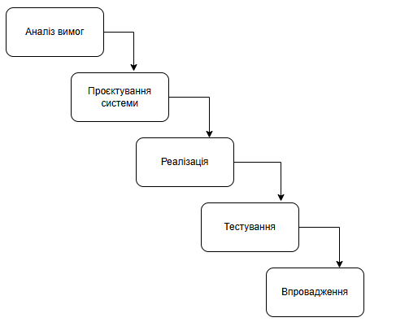

# Модель розробки

Проект: Завдання: Застосунок-навігатор для “Днів відкритих дверей”

Команда: "CodeWay"

## Водоспадна модель

## Модель життєвого циклу проекту

## Основні етапи життєвого циклу

>- Аналіз вимог
>   - Збираємо вимоги до навігатора (GPS, QR-коди, карта, маршрути).
>   - Визначення місцеположення через GPS.
>   - Використання QR-кодів для точної навігації.
>   - Відображення карти коледжу.
>   - Побудова маршрутів між аудиторіями.
>   - Документуємо всі вимоги, затверджуємо їх у замовника.
>- Проєктування системи
>   - Розробляємо архітектуру системи (основні класи, взаємодію між компонентами).
>   - Визначаємо, як буде працювати GPS-визначення місцеположення.
>   - Вибираємо бібліотеки та технології (JavaScript, HTML, CSS, Web API для геолокації).
>   - Створюємо макет карти та інтерфейсу.
>- Реалізація
>   - Отримання GPS-координат.
>   - Обробки QR-кодів.
>   - Відображення карти.
>   - Побудови маршрутів.
>   - Верстаємо інтерфейс користувача.
>   - Інтегруємо всі модулі в єдину систему.
>- Тестування
>   - Перевіряємо коректність роботи всіх функцій.
>   - Тестуємо точність визначення місцеположення (GPS + QR-коди).
>   - Переконуємось, що навігація будується правильно.
>   - Виправляємо помилки перед запуском.
>- Впровадження
>   - Розміщення на хостингу.

---

- [x] *Кабановський І.В.*

---
[:arrow_up: Повернутись до початку етапу](/docs/2.Planning/README.md)
