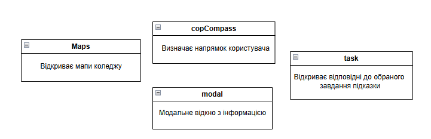

# ФУНКЦІОНАЛЬНА СПЕЦИФІКАЦІЯ

Етап: *Розробка (Developing)*

Проект: Застосунок-навігатор для "Днів відкритих дверей"

Команда: CodeWay

Виконали:
>*Кабановський І.В.*

## **1. БАЧЕННЯ І РАМКИ**
Web-застосунок, з футуристичним дизайном, але без зайвих деталей. Інтерфейс повинен бути мінімально необхідним. Легке та інтуєтивне розуміння, використання застосунку.
#### ФУНКЦІОНАЛЬНІСТЬ РІШЕННЯ
Основні можливості навігаційного застосунку для “Днів відкритих дверей”:
- інтерактивний пошук маршруту до кабінету 221
- сканування QR-коду для швидкого завантаження маршруту
- адаптивний веб-інтерфейс для мобільних пристроїв
- відображення загальної карти коледжу

З огляду на фіксований термін роботи над проектом за рамки рішення команда вирішила винести наступні можливості:
- підтримка декількох мов (фокус на українській мові для основної аудиторії)
- голосові підказки (може бути додано в майбутньому як покращення UX)
- мобільний додаток (рішення базується на веб-технологіях для зручності доступу без встановлення)

## **2. ІСТОРІЯ ПРОЕКТУ**

*24.03.2025* - Початок проекту. Формування проектної групи. Розподіл ролей. 

*25.03.2025* - Оформлення протоколу та затвердження його замовником.

*26.03.2025* - Концепція та структура проєкту

*27.03.2025* - Діаграма прецедентів та аналіз ризиків

*07.04.2025* - Початок розробки застосунку

*11.04.2025* - Розгортання застосунку та тестування
 
## **3. ЦІЛІ ПРОЕКТУВАННЯ**

Цей розділ документу узагальнює виконаний раніше *аналіз вимог*. Формулюються вимоги *з точки зору замовника, користувачів, апаратного та програмного оточення*. 

Ці вимоги, сформульовані раніше *в загальному вигляді*, в цьому документі мають  бути скоректовані у вимоги до *рішення та його окремих компонентів* в термінах *команди розробників*. В результаті відбувається **уточнення цілей проекту**, сформульованих раніше в баченні/рамках проекту.

### **3.1. Вимоги користувача**

Основні вимоги до функціональності застосунку-навігатора для “Днів відкритих дверей”:
- можливість швидкого пошуку кабінету 221 за допомогою інтерактивної навігації
- відображення покрокових інструкцій для переміщення коледжем
- підтримка сканування QR-кодів для автоматичного відкриття маршруту
- мінімалістичний, футуристичний інтерфейс із максимально простою навігацією
- адаптація для мобільних пристроїв (зручність використання на смартфонах)
- доступ до інформації без необхідності авторизації
- швидке завантаження сторінок і відсутність затримок у відображенні контенту
- можливість перегляду загальної карти коледжу та основних зон
### **3.2. Системні вимоги**
Системні вимоги до продукту: 
- застосунок має бути веб-орієнтованим і працювати у браузері без необхідності встановлення
- підтримка сучасних браузерів (Chrome, Firefox, Edge, Safari)
- коректне відображення на мобільних пристроях та планшетах
- відсутність необхідності у серверній частині (усі дані мають бути доступні у статичному форматі)
- інтерактивність реалізується за допомогою JavaScript (без використання backend-технологій)
- застосунок має бути легким, швидким і не перевантажувати пристрої користувачів
- дотримання принципів UX/UI для забезпечення інтуїтивного використання
### **3.3. Сценарії використання**

Надана діаграма містить основні прецеденти та акторів для системи навігації до коледжу. Проте структура потребує уточнення:  
- "Користувач" є основним актором.  
- "Система позиціонування" має бути зовнішнім актором або підсистемою, яка допомагає реалізувати прецеденти.  
- Прецеденти пов’язані з функціоналом визначення місця, побудови маршруту та відображення інструкцій.

## **4. ВИКЛЮЧЕНІ МОЖЛИВОСТІ Й НЕПІДТРИМУВАНІ СЦЕНАРІЇ**
*покрокова візуалізація шляху всередині будівлі* 
Від данною функціональності була відмова по таким причинам:
- Недостатня точність GPS в будівлі
- Недостатньо часу для розробки такої функціональності 

Дану функціональність можливо відтворити за наявності повного покриття коледжу bluetooth маячків, для точного визначення місцезнаходження користувача. Також потрібний час для розробки 3-4 тижні.
 
## **5. ПРИПУЩЕННЯ І ЗАЛЕЖНОСТІ**

### **Припущення і Обмеження**
Основні *припущення* стосовно функціональності проекту: 
- Абітурієнти мають доступ до смартфонів або інших пристроїв з інтернет-з’єднанням.
- QR-коди можуть бути розміщені у ключових місцях коледжу для швидкого доступу до навігації.
- Інформація про розташування аудиторій буде оновлюватись адміністрацією коледжу у разі змін.

### Обмеження, які слід враховувати:
- Розробка використовуватиме лише HTML, CSS та JavaScript без серверної частини.
- Веб-застосунок має бути адаптований для мобільних пристроїв та коректно відображатися у популярних браузерах (Chrome, Firefox, Edge, Safari).
- Відсутня інтеграція з картографічними сервісами (Google Maps, OpenStreetMap), оскільки навігація потрібна лише в межах коледжу.
- Система не передбачає реєстрацію чи авторизацію користувачів – доступ до навігації має бути відкритим.
- Завантаження сторінки та навігація мають бути максимально швидкими, без значних затримок.
- Перший прототип веб-застосунку має бути готовий протягом трьох тижнів після початку розробки.

 
## **6. ПРОЕКТ РІШЕННЯ**

Проект рішення *узагальнює документи, створені в рамках проектування майбутнього рішення*, в короткій стислій формі. При цьому вказуються призначення та важливість для проекту зазначених документів. Ця інформація сприяє виробленню у читача ясного уявлення про концепцію проектування рішення.

### **6.1. Концептуальний проект**

Для навігації по коледжу буде використаний компас. При старті буде вказаний напрямок по компасу, за яки потрібно рухатись користувачу, щоб знайти потрібний йому орієнтир. Зверху, написано підсказку для обраного завдання. 
Діаграма скриптів: 

### **6.2. Логічний проект**

 
Скрипти між собою не взаємодіють, а лиш відповідають за окрему функціональність на сторінці index.html.

### **6.3. Фізичний проект**

Проєкт реалізований за допомогою **HTML**, **CSS** та **JavaScript** (без використання фреймворків). Уся логіка реалізована у вигляді окремих JS-модулів. 

Система розгорнута на **GitHub Pages**, що забезпечує простий та безкоштовний хостинг клієнтської частини.

#### Основні компоненти:
- `Maps.js` — Відображення при натисканні на кнопки карт
- `copCompass.js` — Компас, відповідає за відображення напрямку користувача
- `task.js` — Відображення текстових підсказок при виборі завдання
- `modal.js` — Відображення текстового повідомлення про завдання

> Усі компоненти побудовані з урахуванням повторного використання.

#### Розгортання:
- Клієнт <-> GitHub Pages (html, css, js)
 
## **7. ВИМОГИ ДО ІНСТАЛЯЦІЇ І ДЕІНСТАЛЯЦІЇ**
Для розгортання основний файл index.html потрібно розмістити в кореневій теці проекту у github. За допомогою GitHub Pages розгорнути проект. Для деінсталяції, потрібно відключити Pages в налаштуваннях репозеторію.
## **8. РИЗИКИ**
>|Ризик|Дослідження|Наслідок|Погодження|Уникнення|Перенесення|Запобігання|Пом'якшення наслідків|
>| :- | :- | :- | :- | :- | :- | :- | :- |
>|1|Низька зацікавленість команди у виконанні завдання|Визначити причини низької зацікавленості.|Не прийнятно, оскільки це впливає на якість.|Неможливо.|Неможливо.|Впровадження мотиваційних програм, або відеозустрічей, зацікавлення учня позитивною оцінкою.|Організація відеозустрічей, зміна підходу до керування.|
>|2|Брак досвіду у команди|Аналіз слабких сторін команди.|Високий ризик, необхідні заходи.|Підготовка команди заздалегідь до цього проєкту.|Найм досвідчених консультантів, або зміна членів команди.|Проведення навчання.|Контроль та корекція результатів роботи менеджерами проєкту та більш компетентними працівниками.|
>|3|Невідповідність можливостей технології GPS і очікувань замовника|Аналіз можливостей технології.|Недоцільно.|Консультації зі сторонніми експертами, можливо вони зможуть покращити сигнал GPS в будівлі.|Можливо, але після домвленностей з навчальним закладом.|Тестування альтернативних рішень, наприклад заздалегідь завантажена мапа відкритих дверей в програму, але э свої мінуси.|Готовність до зміни технічного рішення.|
>|4|Відсутність розуміння програми у волонтерів|Аналіз очікувань волонтерів.|Може бути прийнято з компенсаційними заходами.|Неможливо.|Залучення зовнішніх субпідрядників, з метою навчання волонтерів користуватися програмою.|Створення простого та зрозумілого інтерфейсу.|Впровадження навчальних матеріалів.|
>|5|Затримки в реалізації проекту|Визначення можливих причин затримок.|Небажано.|Неможливо.| Делегування частини робіт стороннім підрядникам.|Оптимізація процесів, контроль термінів.|Перерозподіл ресурсів, перегляд пріоритетів.|

---

- [x] *Кабановський І.В.*

---
[:arrow_up: Повернутись до початку етапу](/docs/3.Developing/README.md)
